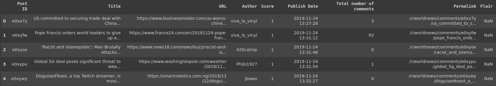
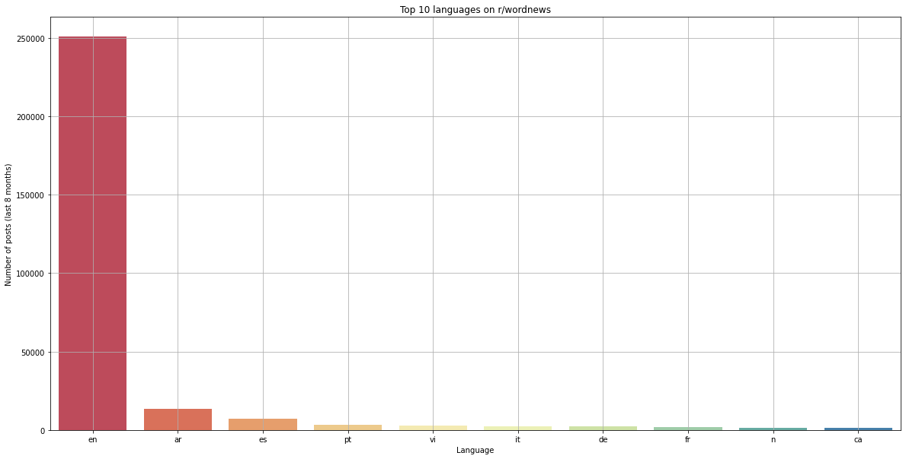
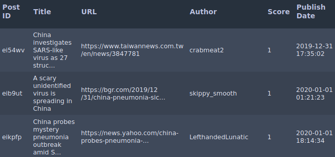
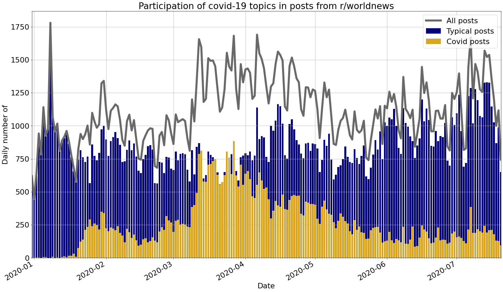
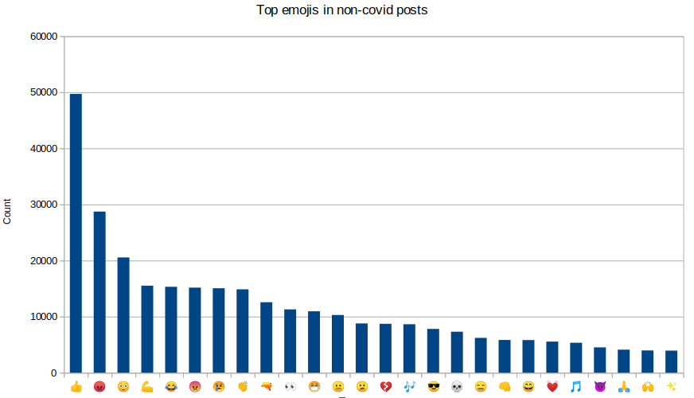
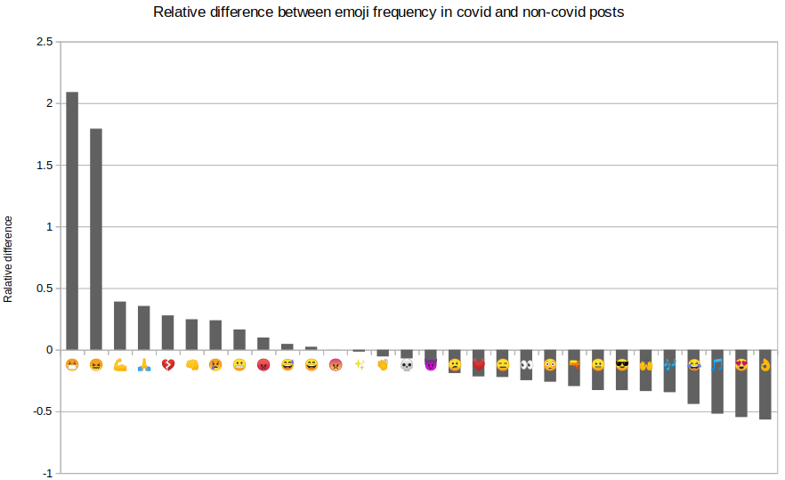
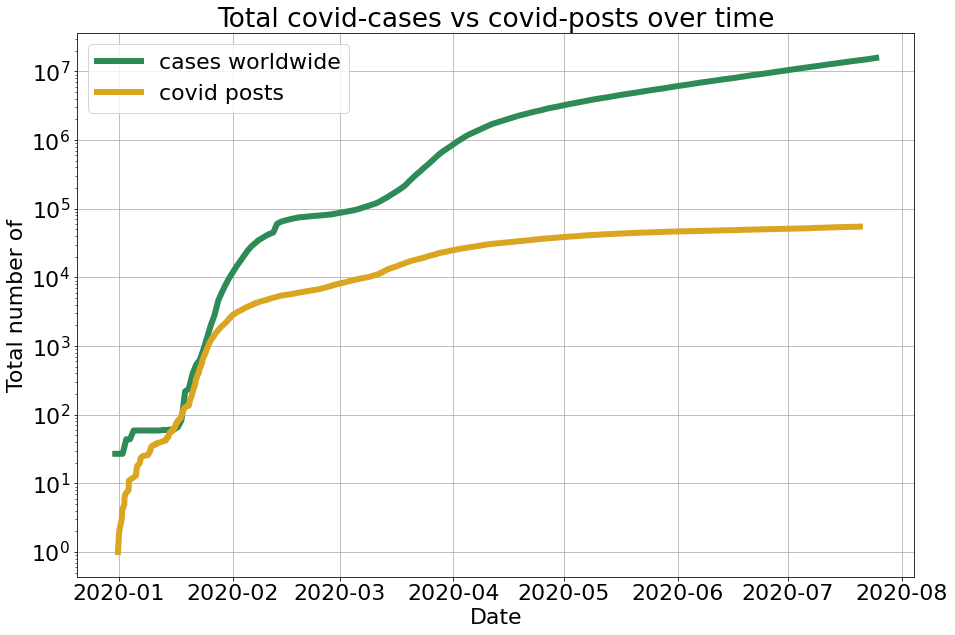

# Description

This project consists of exploratory data analysis of posts from subreddit r/wordnews. All posts' titles are processed for their emotions with help of DeepMoji pretrained model. Special emphasis was placed on analysis of COVID-19 related posts, including a comparison of number of posts vs total active cases. Subreddit dataset has been acquired through Pushshift API. COVID-19 statistics comes from [Open Word in Data](https://ourworldindata.org/coronavirus-source-data).

## How to follow the project

This is exploratory data analysis. Interesting visualisation and takeaways are all included in this readme. Additionally, the repository contains datasets and source code. 
Processed datasets from intermidiate and final steps can be found in 'datasets.zip'. 
The source code is shared in form of separated Jupyter Notebooks divided into 3 groups:
1. SCRAPING... - downloading posts data
2. PROCESSING... - processing data (language detection and emoji assignment)
3. VISUAL... - final visualisation and summaries

## Analysis

Posts dataset comes from subreddit 'wordnews'. It contains over 250 000 records dating from December 2019 to July 2020.

### Post's data structure

A sample of collected data can be seen below. 
 
From available fields 'Title', 'Publish Date' and 'Flair' are to be used for further analysis:
- Title - Set of words briefly describing a news
- Publish Date - Datetime based on UTC timezone
- Flair - Tag assigned by the original poster (optional)

### Language detection

Subreddit wordnews is typically aimed for English speaking users but there were discovered posts wirtten in other languages. It would be interesing to quantify non-English posts and see whether they are a significant minority. For language detection there was used 'langdetect' library feeded with posts' titles. The results can be seen below: 
 
English has been detected in 85% of the posts. Next 3 most popular languages are Arabic - 4.6%, Spanish - 2.4% and Portuguese - 1.1%.

### Posts division

Most important part of data preprocessing was correct division of posts into 2 groups: covid-related and non-covid-realted. The first apprach was to filter by 'COVID-19' Flair but this tag was introduced late in March 2020. In final version, covid-realted posts are those meeting 1 of the following conditions:
- 'COVID-19' Flair
- At least one of the following words in a Title {'virus', 'sars', 'covid', 'pandemic', 'epidemy'}
<!-- -->
First posts filtered by this conditions comes from 2019/2020 New Year's Eve. 
 
When we look closer at posts participation over time. Covid-19 topics were in minority until 2nd half of January 2020 when there was a rapid increase from 10s to 100s news per day. 

### Emoji assignment & comparison

With use of [torchMoji](https://github.com/huggingface/torchMoji) (pyTorch implementation of DeepMoji model) every post got assigned 5 most suitable emojis based on a title text. Emoji distribution for typical posts can be seen below: 
 
We can see that '👍' is the most popular emoji but also the least expressive one, therefore it is ignored in further analysis. To compare emoji from covid-related news with typical posts a frequency of occurance was calculated for each group. Then a comparsion was made based on realtive difference between frequencies. Emojis that were less frequent than 1/100 posts in both groups were excluded from this summary. 
 
Discovered differences show that in covid-related posts there is more strong negative emotions like 😷 😖 💔 😢 and less strong positive like 👌 😍 😂 🙌. In covid news we can also see more reference to faith/hope 🙏 and general 'stay strong' attitude 💪 👊.

### COVID posts vs total cases

Another very interesting summary can be comparison between total number of covid-19 cases and total number of virus related posts. 
 
We can see that in early epidemy stages December 2019 - April 2020 total number of cases and number of posts follow the same pattern with similar seasons of growth. Interesting that after May 2020 reddit users show decline in interest around covid-19 news while worldwide number of cases is steadily growing.